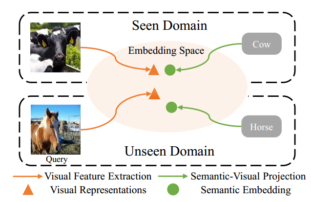

# Awesome Zero-Shot Learning 

  

A collection of resources on Zero-Shot Learning.

## Why awesome Zero-Shot Learning?
Zero-Shot Learning targets to recognize samples from either seen or unseen classes, which can be applied to image classification, object detection, and semantic segmentation.
This is a collection of papers and resources I curated when learning the ropes in Zero-Shot Learning. I will be continuously updating this list with the latest papers and resources. 
If you want to learn the basics of Zero-Shot Learning and understand how the field has evolved, check out these articles I published on ...

## Contributing

If you think I have missed out on something (or) have any suggestions (papers, implementations and other resources), feel free to [pull a request](https://github.com/mboboGO/awesome-zero-shot-learning/pulls)

Feedback and contributions are welcome!

## Table of Contents
- [Basics](#basics)
- [Papers](#papers)
  - [Emedding-based ZSL](#embedding-based-zsl)
  - [Generative ZSL](#generative-zsl)
  - [ZSL Detection](#zsl-detection)
  - [ZSL Segmentation](#zsl-segmentation)
- [Datasets](#datasets) 
- [Blog posts](#blogposts)
- [Popular implementations](#popular-implementations)
  - [PyTorch](#pytorch)
  - [TensorFlow](#tensorflow)
  - [Torch](#Torch)
  - [Others](#others)

## Basics
- [A 2019 guide to Human Pose Estimation with Deep Learning](https://blog.nanonets.com/human-pose-estimation-2d-guide/?utm_source=reddit&utm_medium=social&utm_campaign=pose&utm_content=GROUP_NAME)

## Papers

### Embedding-based ZSL
- [Hierarchical Disentanglement of Discriminative Latent Features for Zero-shot Learning](http://openaccess.thecvf.com/content_CVPR_2019/papers/Tong_Hierarchical_Disentanglement_of_Discriminative_Latent_Features_for_Zero-Shot_Learning_CVPR_2019_paper.pdf) - Bin Tong, Chao Wang, Martin Klinkigt, Yoshiyuki Kobayashi, Yuuichi Nonaka. (CVPR 2019)
- [Semantically Aligned Bias Reducing Zero Shot Learning](http://openaccess.thecvf.com/content_CVPR_2019/papers/Paul_Semantically_Aligned_Bias_Reducing_Zero_Shot_Learning_CVPR_2019_paper.pdf) - Akanksha Paul, Naraynan C Krishnan, Prateek Munjal. (CVPR 2019)
- [Creativity Inspired Zero-Shot Learning] (https://arxiv.org/pdf/1904.01109.pdf) - Mohamed Elhoseiny, Mohamed Elfeki. (ICCV 2019)
- [Generalized Zero-Shot Recognition based on Visually Semantic Embedding](http://openaccess.thecvf.com/content_CVPR_2019/papers/Zhu_Generalized_Zero-Shot_Recognition_Based_on_Visually_Semantic_Embedding_CVPR_2019_paper.pdf) - Pengkai Zhu, Hanxiao Wang, Venkatesh Saligrama. (CVPR 2019)
- [Attentive Region Embedding Network for Zero-shot Learning](http://openaccess.thecvf.com/content_CVPR_2019/papers/Xie_Attentive_Region_Embedding_Network_for_Zero-Shot_Learning_CVPR_2019_paper.pdf) - Guo-Sen Xie, Li Liu, Xiaobo Jin, Fan Zhu, Zheng Zhang, Jie Qin, Yazhou Yao, Ling Shao. (CVPR 2019)
- [Marginalized Latent Semantic Encoder for Zero-Shot Learning](http://openaccess.thecvf.com/content_CVPR_2019/papers/Ding_Marginalized_Latent_Semantic_Encoder_for_Zero-Shot_Learning_CVPR_2019_paper.pdf) - Zhengming Ding and Hongfu Liu. (CVPR 2019)
- [Progressive Ensemble Networks for Zero-Shot Recognition](https://arxiv.org/pdf/1805.07473.pdf) - Meng Ye, Yuhong Guo. (Tranductive Learning) (CVPR 2019)
- [Rethinking Knowledge Graph Propagation for Zero-Shot Learning](https://arxiv.org/pdf/1805.11724.pdf) - [[CODE]](https://github.com/cyvius96/adgpm)  - Michael Kampffmeyer, Yinbo Chen, Xiaodan Liang, Hao Wang, Yujia Zhang, and Eric P. Xing. (CVPR 2019)

### ZSL Segmentation
- [Zero-Shot Semantic Segmentation](https://arxiv.org/abs/1906.00817) -- [[CODE]](https://github.com/RohanDoshi2018/ZeroshotSemanticSegmentation) Maxime Bucher, Tuan-Hung Vu, Matthieu Cord, Patrick Pérez. (arXiv19)

## Datasets
### 2D
- [MPII Human Pose Dataset](http://human-pose.mpi-inf.mpg.de/)
- [LSP](http://sam.johnson.io/research/lsp.html)
- [FLIC](https://bensapp.github.io/flic-dataset.html)
- [FLIC-plus](https://cims.nyu.edu/~tompson/flic_plus.htm)

### 3D
- [Human3.6M](http://vision.imar.ro/human3.6m/description.php)
- [HumanEva](http://humaneva.is.tue.mpg.de/)
- [MPI-INF-3DHP](http://gvv.mpi-inf.mpg.de/3dhp-dataset/)
- [Unite The People](http://files.is.tuebingen.mpg.de/classner/up/)

## Workshops
- [POSETRACK-ECCV](https://posetrack.net/workshops/eccv2018/)
- [3D HUMANS-CVPR 2018](https://project.inria.fr/humans2018/)

## Blog posts
- [Real-time Human Pose Estimation in the Browser with TensorFlow.js](https://medium.com/tensorflow/real-time-human-pose-estimation-in-the-browser-with-tensorflow-js-7dd0bc881cd5)
- [Deep learning for human pose estimation](https://www.slideshare.net/plutoyang/mmlab-seminar-2016-deep-learning-for-human-pose-estimation)
- [Deep Learning based Human Pose Estimation using OpenCV ( C++ / Python )](https://www.learnopencv.com/deep-learning-based-human-pose-estimation-using-opencv-cpp-python/)

## Popular implementations

### PyTorch
- [pytorch-pose-hg-3d](https://github.com/xingyizhou/Pytorch-pose-hg-3d)
- [3d_pose_baseline_pytorch](https://github.com/weigq/3d_pose_baseline_pytorch)
- [pytorch_Realtime_Multi-Person_Pose_Estimation](https://github.com/tensorboy/pytorch_Realtime_Multi-Person_Pose_Estimation)
- [AlphaPose](https://github.com/MVIG-SJTU/AlphaPose/tree/pytorch)
- [pytorch-pose](https://github.com/bearpaw/pytorch-pose)
- [human-pose-estimation.pytorch](https://github.com/Microsoft/human-pose-estimation.pytorch)
- [deep-high-resolution-net.pytorch](https://github.com/leoxiaobin/deep-high-resolution-net.pytorch)

### TensorFlow

- [tf-pose-estimation](https://github.com/ildoonet/tf-pose-estimation)
- [pose-tensorflow](https://github.com/eldar/pose-tensorflow)

### Torch

- [pose-hg-train](https://github.com/umich-vl/pose-hg-train)
- [pose-hg-demo](https://github.com/umich-vl/pose-hg-demo)

### Others

- [openpose](https://github.com/CMU-Perceptual-Computing-Lab/openpose)
- [DensePose](https://github.com/facebookresearch/DensePose)

## Todo

- [x] Add basics
- [ ] Add papers on Person Re-Identification
- [ ] Add papers on Multi Person Pose estimation
- [ ] Add a SOTA ranking

## License

 This work is licensed under a <a rel="license" href="http://creativecommons.org/licenses/by/4.0/">Creative Commons Attribution 4.0 International License</a>.

